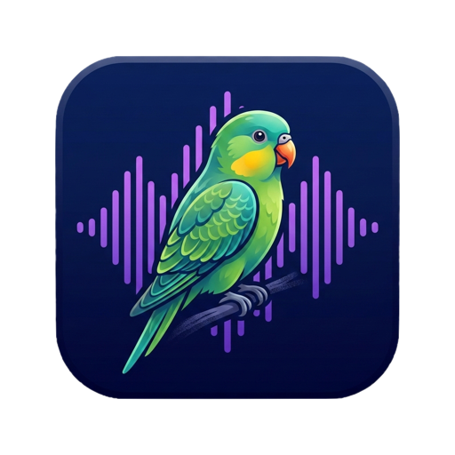

<p align="center">
  
</p>
<h1 align="center">ParakeetFlow</h1>
<p align="center">
  <a href="https://github.com/gafiatulin/parakeet-flow/releases/latest">
    
  </a>
</p>

On-device voice dictation with LLM post-processing. Hold a hotkey (or tap a bubble) to record, release to transcribe and insert cleaned-up text at the cursor. All processing happens locally — no cloud APIs.

> **Note:** This project is an ongoing experiment with agentic coding flows — almost one-shotting entire apps and features. Expect rough edges.

## Features

- **Push-to-talk and hands-free** — hold a hotkey to record, or quick-tap for hands-free mode (macOS); tap or long-press the floating bubble (Android)
- **Backtrack correction** — say "actually", "scratch that", or "no wait" to revise what you just said ("coffee at 2 actually 3" → "coffee at 3")
- **Stutter and false start removal** — repeated words and immediate restarts are cleaned up ("I I think" → "I think")
- **Voice formatting commands** — "new line", "new paragraph", "comma", "period", etc. are converted to punctuation (macOS)
- **Numbered list formatting** — dictate items with numbers and they're formatted as a list (macOS)
- **Filler word removal** — strips um, uh, like, you know, basically, etc. via regex set-match before LLM, and again during LLM cleanup (toggleable)
- **Custom dictionary** — add names, technical terms, or frequently misheard words; fuzzy matching (Levenshtein + Soundex) auto-corrects ASR errors before LLM cleanup, and dictionary words are injected into the LLM prompt as preferred spellings (macOS)
- **Context-aware cleanup** — reads the active app, window title, and surrounding text; adapts tone (casual for Slack, formal for Mail, technical for Xcode) (macOS)
- **Recording overlay** — animated waveform indicator while recording (macOS)
- **Transcription history** — log of past dictations with full pipeline visibility (raw ASR → filtered → dictionary → LLM output), stored in SwiftData (macOS)

## Platforms

### [macOS](mac/)

Menu bar app for macOS 26+ (Tahoe). Uses Apple SpeechAnalyzer for streaming ASR and Apple FoundationModels for LLM cleanup. Alternative backends via FluidAudio (Parakeet TDT) and MLX (Qwen, Phi, Llama).

**Quick start** — requires [XcodeGen](https://github.com/yonaskolb/XcodeGen) (`brew install xcodegen`):

```bash
cd mac
xcodegen generate
xcodebuild build -scheme ParakeetFlow -configuration Debug
```

See the [macOS README](mac/README.md) for detailed build instructions, prerequisites, permissions, and configuration options.

### [Android](android/)

Floating bubble overlay for Android 8+. Uses Sherpa-ONNX with NVIDIA Parakeet TDT 0.6B (int8) for ASR and LiteRT-LM with Qwen3 0.6B (int4) for LLM cleanup.

**Quick start** — requires JDK 17+ and Android SDK with API 36:

```bash
cd android
./gradlew assembleRelease -x lintVitalRelease
```

See the [Android README](android/README.md) for detailed build instructions, permissions, and architecture.

## Architecture

Both platforms share the same pipeline:

```
Audio capture -> ASR -> Filler filter -> Dictionary correction -> LLM cleanup -> Text insertion
                         (optional)         (optional)             (optional)
```

| Component | macOS | Android |
|---|---|---|
| ASR | Apple SpeechAnalyzer (streaming) | Sherpa-ONNX Parakeet TDT (batch) |
| LLM | Apple FoundationModels / MLX | LiteRT-LM Qwen3 0.6B |
| Trigger | Hotkey (Option hold/release) | Floating bubble (tap/hold) |
| Text insertion | Clipboard + Cmd+V | AccessibilityService |
| Context | AXUIElement + NSWorkspace | AccessibilityService |

## License

MIT
